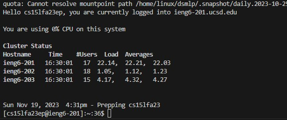
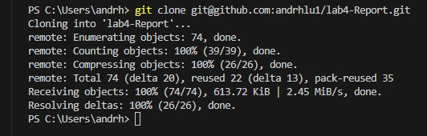
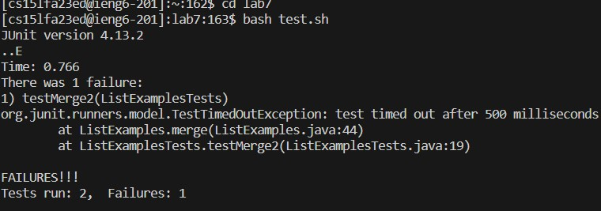
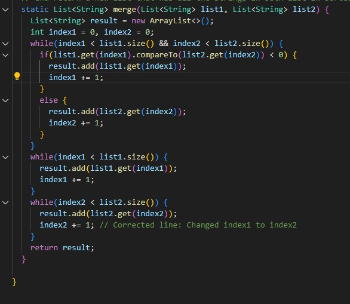
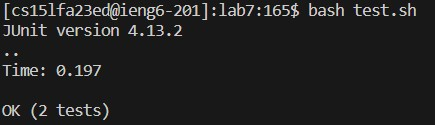
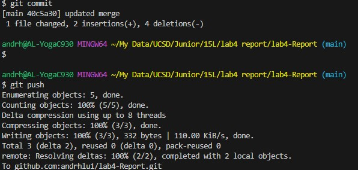

Keys pressed:
```
ssh<space>cse15lfa23ep@ieng6.ucsd.edu<enter>
```
Summary: 

Logged into ieng6



Keys pressed:
```
<click window with Github fork> <click code button> <click copy button undder SSH tab> <click terminal> <git <space> clone <space> <Ctrl> v <enter> 
```
Summary:

forked lab then copied ssh URL using the cursor and ran git clone command with copied url which cloned the forked lab into my home directory.



Keys pressed:
```
cd <space> lab7 <enter> bash <enter> test.sh <enter>
```
Summary:

changed directories to lab 7 to access test.sh. Then ran the file running tests.



Keys pressed:
```
vim <space> <shift> L <tab> .j <tab> <enter> 43j e x i 2 <essc> :wq <enter>
```
Summary:

used vim command to find the to open ListExamples,java. 42j e x i 2 went to line 43, jumped to the end of the first word and deleted 11 and replaced it with 2. :wq <enter> saved and quit. 



Keys pressed:
```
<up> <up> <enter>
```
Summary:

used two commands prioer in bash history using <up> <up> <enter> to run test.sh



Keys pressed:
```
git <spaced> add <spaced> <shift> L <tab> <enter> git <space> commit <space> -m <space> "updated <space> merge" <enter> git <space> push <enter>
```
Summary:

used git add L to add the new "ListExamples.java" to be commited. used git commit -m "updated merge" and pressed <enter> to commit changes and add message. Then pushed lab repository with the commmand git push.
